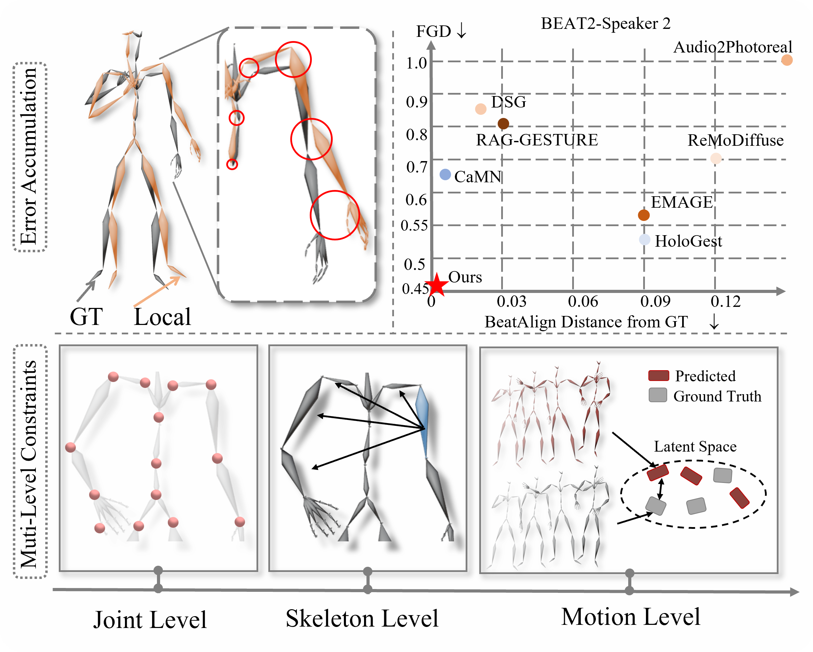

# 🌐 GlobalDiff

**[AAAI 2026] Mitigating Error Accumulation in Co-Speech Motion Generation via Global Rotation Diffusion and Multi-Level Constraints**

---

🚧 **Code Release Plan**  
The code will be released **within this month**.  
Thank you for your patience and support 🙏

Stay tuned for updates ✨
