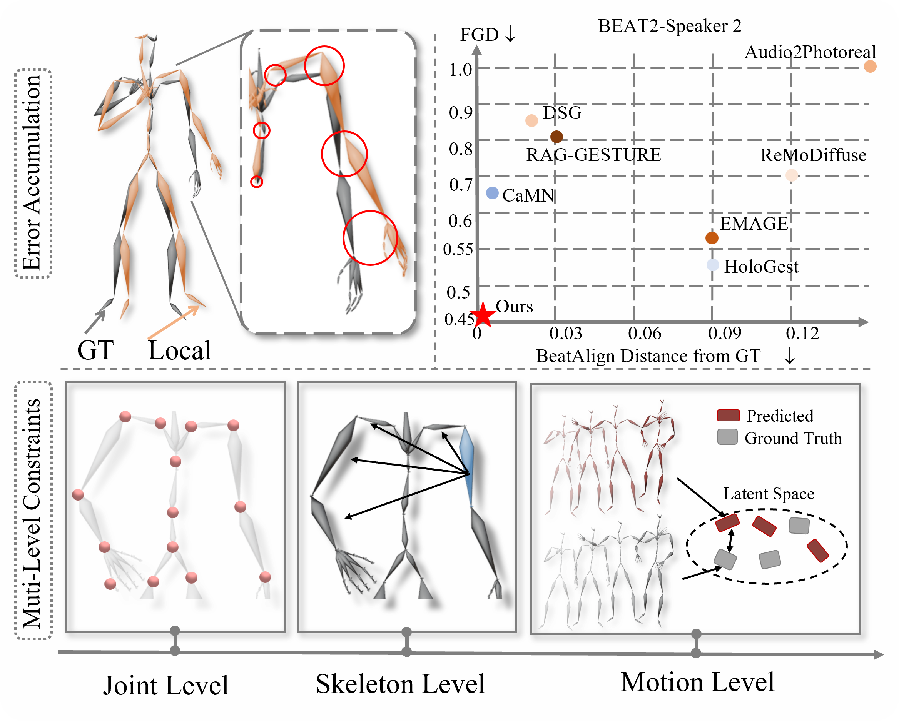

<div align="center">
<h2><font> </font></center> <br> <center>Mitigating Error Accumulation in Co-Speech Motion Generation via Global Rotation Diffusion and Multi-Level Constraints</h2>

[Xiangyue Zhang\*](https://xiangyue-zhang.github.io/), [Jianfang Li\*†](https://github.com/Xiangyue-Zhang/SemTalk), [Jianqiang Ren](https://github.com/JianqiangRen), [Jiaxu Zhang](https://kebii.github.io/)

<p align="center">
  <strong>✨AAAI 2026✨</strong>
</p>

<a href='https://arxiv.org/abs/2511.10076'></a> <a href='https://xiangyue-zhang.github.io/GlobalDiff/'></a>

GlobalDiff is developed by Alibaba Cloud and released under the **Apache License 2.0**.


</div>

## 🚧 Code Release Plan
- Training: ✅ 2025.12.29
- Testing: ✅ 2025.12.29

---

# 🛠️ Environment Setup

The repository currently does not ship a frozen `requirements.txt`, so we recommend preparing the environment explicitly before data preprocessing, training, or inference.

## Recommended Setup

- OS: Linux
- Python: 3.10
- CUDA: 11.8 or a version compatible with your local PyTorch build
- GPU: at least 1 NVIDIA GPU for inference, 4 GPUs are recommended for the training command used below

Create a conda environment:

```shell
conda create -n globaldiff python=3.10 -y
conda activate globaldiff
```

Install PyTorch first. Please choose the command that matches your CUDA version from the official PyTorch website. For CUDA 11.8, you can use:

```shell
pip install torch torchvision torchaudio --index-url https://download.pytorch.org/whl/cu118
```

Then install the Python dependencies used by this repository:

```shell
pip install numpy scipy pandas librosa soundfile lmdb tqdm einops tensorboard smplx transformers diffusers positional-encodings
```

## External Resources

GlobalDiff also relies on two external resources:

1. **SMPL-X model file**  
   Download `SMPLX_NEUTRAL_2020.npz` from the official SMPL-X release, then either:
   - place it at `Data/SMPLX_NEUTRAL_2020.npz`, or
   - set `GLOBALDIFF_SMPLX_MODEL_PATH` to its absolute path

2. **WavLM checkpoint**  
   By default, the code now uses the Hugging Face model id `patrickvonplaten/wavlm-libri-clean-100h-large`.  
   If you already have the model cached locally, you can point the code to that directory with:

```shell
export GLOBALDIFF_SMPLX_MODEL_PATH=/path/to/SMPLX_NEUTRAL_2020.npz
export GLOBALDIFF_WAVLM_PATH=/path/to/wavlm-libri-clean-100h-large
```

If you do not set `GLOBALDIFF_WAVLM_PATH`, Transformers will download the model automatically from Hugging Face the first time it is used.

## Quick Check

After finishing the environment setup, make sure the following are ready before training or inference:

- `Data/BEAT2/create_lmdb.py` can access your downloaded BEAT2 data
- `Scripts/VAE/ckpt/split/global/MaskedVAE2-HorizonFlip/best.pt` exists
- `Scripts/VAE/ckpt/split/global/MaskedVAE3-HorizonFlip/best.pt` exists
- `Scripts/FM/ckpt/split/SimpleSpeechModel/best.pt` is available after unzipping `best.zip`

---

# 💖 Inference Data

If you would like to compare your paper’s results with GlobalDiff but find it too difficult to run the repository, you can simply download the test `.npz` file. Results for **person-2** are provided in `best_pid_2.zip`.

If you want to compare your results with our method, you could just simply download [all test results](https://drive.google.com/file/d/1FT5JyPKiHSimpy4imusYLs_Haq4JSd3o/view?usp=drive_link) without reproducing the codes.

## Download Data

please refer to [EMAGE](https://github.com/PantoMatrix/PantoMatrix/tree/main) and download datasets from [BEAT2](https://huggingface.co/datasets/H-Liu1997/BEAT2) for datasets.
If you are in China, you can use hf-mirror for faster and more reliable downloads. The process may take some time, so please be patient.
```shell
pip install -U huggingface_hub
export HF_ENDPOINT=https://hf-mirror.com
huggingface-cli download --repo-type dataset --resume-download H-Liu1997/BEAT2 --local-dir H-Liu1997/BEAT2
```

## 1) Create Training Data

Go to `Data/BEAT2`, then run:

```shell
cd Data/BEAT2
```

Create LMDB:
```shell
    python create_lmdb.py path_to_folder/beat_v2.0.0/beat_english_v2.0.0/
```
This may take a while. Then extract HuBERT features:
```shell
    python create_hubert.py train_seq_size_60_stride_size_20_global.lmdb
```
This takes about **1 hour**.

You will get two folders:
- `train_seq_size_60_stride_size_20_global.lmdb`
- `train_seq_size_60_stride_size_20_global_wavlm.lmdb`

---

## 2) Training

Unzip `best.zip` to:

-    `Scripts/FM/ckpt/split/SimpleSpeechModel/`

Then run training:
```shell
    cd Scripts/FM
    torchrun --nproc_per_node=4 TrainFixedExpressions.py
```
---

## 3) Inference
```shell
    python Test_FixedExpressions_pid_batch.py \
      ckpt/split/DiffusionDITNetPartsFixedExpressions2PostNorm_LL_split_HorizonFlip_MaskedVAE3_W02_BoneDirLoss \
      --data_root=path_to_folder/beat_v2.0.0/beat_english_v2.0.0/
```
This will run **all checkpoints sequentially**. The FID record is saved to:

-    `ckpt/split/DiffusionDITNetPartsFixedExpressions2PostNorm_LL_split_HorizonFlip_MaskedVAE3_W02_BoneDirLoss/record_2.txt`

The results with the best FID are saved to:

-    `ckpt/split/DiffusionDITNetPartsFixedExpressions2PostNorm_LL_split_HorizonFlip_MaskedVAE3_W02_BoneDirLoss/best_pid_2/`

> **Note:** This FID is computed using our internal evaluation implementation.  
> For fair comparison, please use the official evaluation from **EMAGE** or **SemTalk**:
> - EMAGE: https://pantomatrix.github.io/EMAGE/
> - SemTalk: https://github.com/Xiangyue-Zhang/SemTalk

---

## 4) 📺 Visualization

Following [EMAGE](https://github.com/PantoMatrix/PantoMatrix), you can download [SMPLX blender addon](https://huggingface.co/datasets/H-Liu1997/BEAT2_Tools/blob/main/smplx_blender_addon_20230921.zip), and install it in your blender 3.x or 4.x. Click the button Add Animation to visualize the generated smplx file (like xxx.npz).

# 🙏 Acknowledgments
Thanks to [EMAGE](https://github.com/PantoMatrix/PantoMatrix/tree/main/scripts/EMAGE_2024), [SemTalk](https://github.com/Xiangyue-Zhang/SemTalk), our code is partially borrowing from them. Please check these useful repos.

## 📚 Citation
If you find our code or paper helps, please consider citing:
```bibtex
    @article{zhang2025mitigating,
      title={Mitigating Error Accumulation in Co-Speech Motion Generation via Global Rotation Diffusion and Multi-Level Constraints},
      author={Zhang, Xiangyue and Li, Jianfang and Ren, Jianqiang and Zhang, Jiaxu},
      journal={arXiv preprint arXiv:2511.10076},
      year={2025}
    }
```
